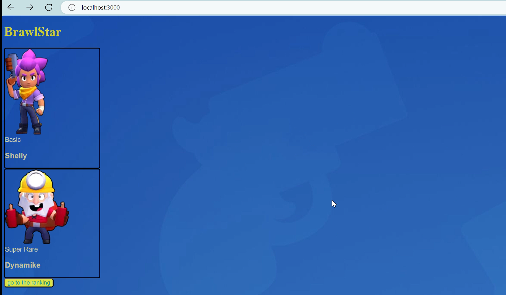
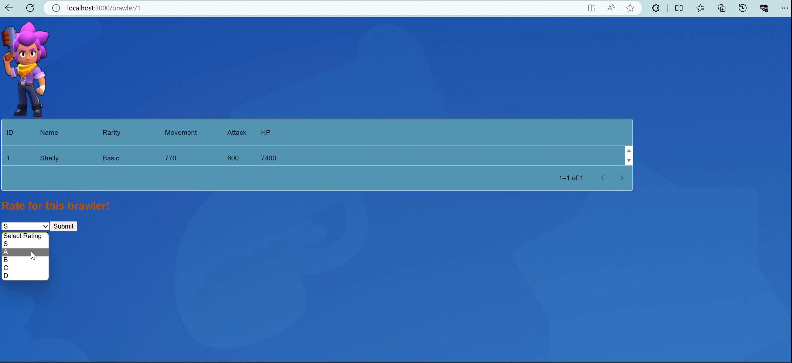
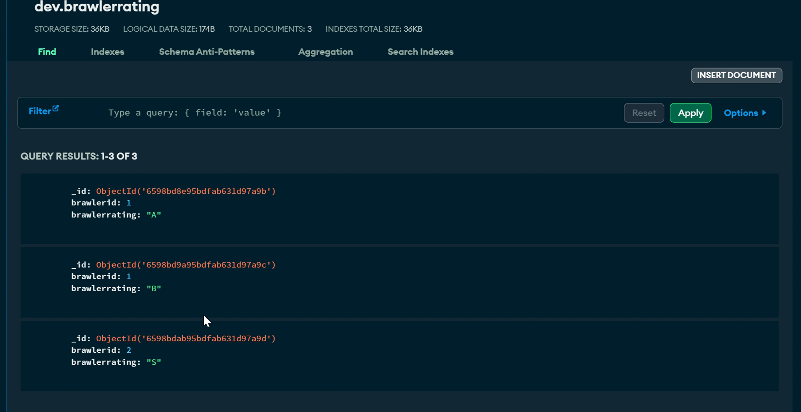
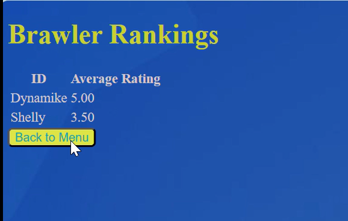

# React Develop

## Overview

In this repository, i will introduce basic knowledge of using React to implement basic functions. Here i put the code of frontend in the 'react-develop/src' (the dependencies are generated by react and we do not need to touch it.) while the backend in the 'RESTAPI'(just a simple backend to handle insert and retrieve data from database).

## Initialization
`cd .\react-develop\`  
Your folder needs to fullfill the following requrements:
 * name can only contain URL-friendly characters
* name can no longer contain capital letters  

`npx create-react-app ./`  
Now a new project folder is established. You can check it out on a browser using command  
`npm start`  
And you will see the default static website of your react project.

## useState
useState is a React Hook that lets you add a state variable to your component.   
useState returns an array with exactly two values:

* The current state. During the first render, it will match the initialState you have passed.
* The set function that lets you update the state to a different value and trigger a re-render.
## share states between different components
Sometimes, you want the state of two components to always change together. To do it, remove state from both of them, move it to their closest common parent, and then pass it down to them via props. 

## use Router to make web page jumps
```
<Router>
        <div>
            <Routes>
                <Route path="/" element={<Home />}/>
                <Route path="/brawler/:brawlerId" element={<BrawlerDetail />} />       
            </Routes>
        </div>

    </Router>
```
use Route path to match different web pages to different components
## use CSS to characterize
We can give each little element a className to match it in .css, which can manage and customize the ui style.
```
<button className='backtomenu'onClick={() => navigate(-1)}>Back to Menu</button>
```
So this button is having a clssName called 'back ot menu', and so we can adjust the style settings in the .css file.
```
.backtomenu{
  color:rgb(25, 161, 161);
  background-color: #dde447;
  border-radius: 5px;
}
```

## Nodemon for API monitoring
When we run an API using node.js, we need to restart the command to watch the API. Here is a more efficient tool: Nodemon, which can keep monitoring the API connection. They refresh while monitoring changes to the .js files.
we can use the following bash code to install it globally:
```
npm i -g nodemon
```
and we can start the monitoring using:
```
nodemon your_filename.js
```

## MonogoDB APIs
Let's supposing we re storing the data into MongoDB, since it is a classic NoSQL database, which means it can store data in non-format ways, with flexible queries supported.   
When connecting to a server, it is important to use async-await clause sentence properly, which means the steps cannot be executed synchronized. Some steps need to be done before going to the next step:(this is always needed while handling requesting and responding situations)
```
const connect = async(brawlerid, brawlerrating) => {
    try {
      // Connect the client to the server (optional starting in v4.7)
      await client.connect();
      // Send a ping to confirm a successful connection
      await client.db("dev").command({ ping: 1 });
      console.log("Pinged your deployment. You successfully connected to MongoDB!");
      db=client.db("dev");
      const mycoll=db.collection('brawlerrating');
      try{
        const data= {brawlerid, brawlerrating};
        
        const result = await mycoll.insertOne(data);
      return result;
  } catch (err) {
    console.error(err);
  }
    } finally {
      // Ensures that the client will close when you finish/error
      await client.close();
    }
  };
```
## Connecting frontend and backend
When we want to use the data source from the database, the typical way is to write a REST API using 
```
const express = require('express');
const app = express();
app.get('/brawler-rankings', async (req, res) => {
  try {
    const rankingData = await Ranking(); 
    res.json(rankingData);
  } catch (error) {
    res.status(500).send('error occur');
  }
});
```
Write down all your APIs in such an index.js, and using node or nodemon to run it. Let's say, if your index.js is running on the address xxx:PORT, and the above API is running on xxx:PORT/brawler-rankings, by which your frontend pages are supposed to call.   
I strongly recommend using backend API to do connect to the database and handle the data processin work, even if MongoDB supports different sort of database API, some of which are capable of flexible data pipelines.
## Demo
Here is a small demo(i may make it into a more complete website if i have time in the future)   
Here is a parent page, showing different brawlers.   

   
When you click on the picture of the brawler, it goes into the detail page of the brawler, and the child page is 'parent/brawler/brawler.id'. You can refer to the data of the brawler, and of course, vote for this brawler. 


When you click on the 'submit' button, it will send a POST request to the RESTAPI in the backend to call the corresponding functions to store the data to the database.
   


When you click on the 'go to the ranking' button, it will send a GET request to the RESTAPI and API will call the corresponding functions to retrieve the data from the database and through some data processings, show the overall rankings of the brawlers.   

   

## Summary
This is a very simple demo i tried during my self-learning react.js. This readme is some sort of study notes when i write these codes. I believe that there are still flaws in my works. ALWAYS OPEN for suggestions and comments!


## Reference
[MongoDB documents](https://www.mongodb.com/docs/atlas/app-services/data-api/generated-endpoints/#call-a-data-api-endpoint)   
[React Tutorial](https://react.dev/learn)   
[CSS Tutorial](https://www.w3schools.com/Css/)


